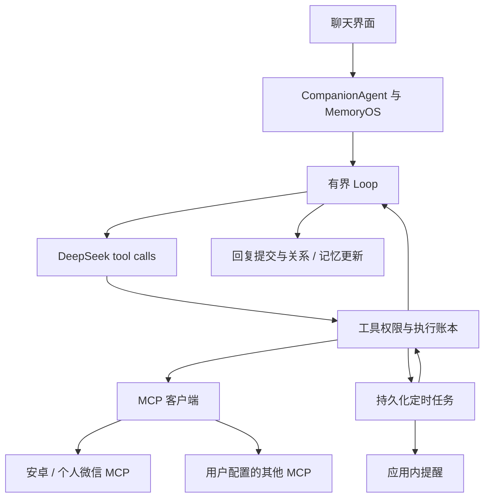

# Loop、MCP、定时与安卓微信

2026-09-23：聊天工具审批现已支持持久化检查点与确认后续跑，重启和回复失败不会自动
重发已完成的操作。另增个人微信 ClawBot 文本收发与本地模拟渠道；它和下述 ADB 界面
操作是两条独立路径。新流程、限制与架构见 [功能说明](FUNCTIONAL_COMPANION.md)。

本次能力接在原 `CompanionAgent` 的模型调用位置。MemoryOS、人设、关系、当前状态与
经历仍由原运行时准备；模型在这一轮中可以执行多步工具调用，最终回复继续走原提交逻辑。

## 使用入口

打开「能力与定时」。三个页签分别提供待确认操作与任务、工具连接、操作记录。

- Loop 默认开启：最多 6 次模型调用、8 次工具调用、180 秒、30,000 Token 预算。
  限制可以在界面调整。时间/Token 达上限后停止启动新步骤；进行中的网络请求受各自
  超时限制。Token 预算根据返回的 usage 统计，无法阻止当前模型调用本身超出余额或预算。
- 聊天中可以说「明天早上九点提醒我喝水」「每隔一小时提醒我活动一下」，由模型选择
  `local_time` 和 `schedule_create`。没有 Key 时仍可在任务表单手工创建提醒。
- 启用工具循环后，支持工具调用的模型可用 `calculate` 核算预算、余额、差额和比例。
  它在本机使用十进制加减乘除，支持括号、中英文结果名称、引用前一步的结果和
  `round(数值, 小数位)` 四舍五入（0 到 12 位小数），不执行 Python 代码或访问网络。
  每次最多 24 个表达式、每式 256 个字符，精度为 28 位有效数字；发生舍入会标为近似。
  计算过程与结果保存在操作记录里。工具只能核对输入的算式，回复里的描述仍需要正确引用结果。
- 一次、每日同一当地时间、固定分钟间隔三种日程，时间保存为 UTC 并记录时区。
  应用内通知可关闭网页后继续生成；需要本地服务和电脑保持运行。没有注册操作系统
  开机启动、手机推送或后台常驻应用。
- 错过多次重复任务会合并执行一次，再计算下一次；重启时正在执行的外部操作标为
  待核对，相关任务暂停，不自动重放。外部操作默认每次确认，等待确认的任务会暂停，
  处理后可手动恢复。停止/取消不会撤回已经发出的外部操作。

## MCP 服务

支持 stdio、Streamable HTTP 和旧 SSE，使用官方 Python SDK 1.x 兼容线（依赖 `<2`）。
配置只由本机设置页面接收；模型无法添加服务、修改启动命令或扩大权限。

1. 填写服务标识与名称、进程命令/参数，或远程 MCP 地址。
2. 远程要求 HTTPS，本机开发服务可以使用 loopback HTTP。凭证通过服务端环境变量传入。
3. 保存后点击「连接并发现工具」。发现工具本身不执行工具，但 stdio 会启动所配置程序。
4. 每个工具可以设为「每次确认」「允许自动调用」「禁用」。MCP 的 readOnly 等注释
   不作为授权依据，新工具默认每次确认。
5. 参数白名单按顶层参数精确匹配，例如 `{"contact":["小雨"]}`、
   `{"package_name":["com.tencent.mm"]}`。空列表会拒绝该参数的所有值；空对象不额外约束。

远程服务 Token 示例：在启动心隅的终端设置 `$env:MY_MCP_TOKEN`，页面 Bearer 字段只填
`MY_MCP_TOKEN`。stdio 映射 `{"TOKEN":"MY_MCP_TOKEN"}` 会将该值注入子进程的 `TOKEN`。
不要把真实密钥放进命令参数、URL、工具参数或聊天内容。

每次调用用新 MCP 会话完成初始化、发现校验和调用，支持无状态 stdio/HTTP 工具服务；
不保留依赖同一进程内会话状态的连接。配置、权限或远程工具定义变化后需要重新确认。
工具返回作为不可信数据交给模型，图片/音频暂不送入模型，只消费文字和结构化结果。
最多向模型暴露 64 个工具（包含 5 个内置工具），超出的工具请分批启用。

同一聊天请求中的相同工具和参数复用执行账本。外部系统没有事务协调，因此超时或断电
不能保证 exactly-once；不确定结果会停止后续步骤，要求核对外部状态。调用日志包含工具
参数与结果，应按本机聊天数据一样保护。不要用多个应用进程共享同一数据目录。

## 安卓手机与个人微信

提供 `companion-phone-mcp` / `python -m companion_agent.integrations.phone`，通过 ADB
操作你指定的一台手机。没有使用微信私有协议、账号令牌提取或聊天数据库破解。

1. 安装 Google 官方 [Android Platform Tools](https://developer.android.com/tools/releases/platform-tools)。
2. 在手机开启 USB 调试，连接数据线，并在手机上接受这台电脑的授权。
3. 在终端运行 `adb devices`，复制状态为 `device` 的序列号。锁屏和 `unauthorized` 状态
   不能操作；不要把 ADB 端口开放到公网。
4. 点击工具连接页的「填入安卓 / 微信模板」，把启动参数中的设备序列号与联系人名称
   改为实际值。包名白名单默认只有 `com.tencent.mm`，多个值用英文逗号分隔。
   如 `adb` 不在 PATH，增加 `"--adb", "C:/Android/platform-tools/adb.exe"`。
5. 勾选启用、保存、连接并发现工具。手机上先手动打开白名单联系人一对一聊天，再让
   伴侣读取当前聊天或发一条指定文字。名字按当前聊天标题精确匹配；不要配置重名联系人
   或群聊。相同显示名无法证明账号身份，发送前应自行确认手机上的聊天对象。

手机工具：

| 工具 | 范围 |
|---|---|
| `phone_status` | 固定设备连接状态与范围 |
| `phone_read_screen` | 白名单前台应用的可见控件，含一次界面指纹 |
| `phone_open_app` | 打开指定白名单包名 |
| `phone_tap` | 根据新鲜界面指纹与控件 ID 点击，禁止通用输入、发送、通话 |
| `phone_navigate` | 从白名单应用返回或回桌面 |
| `wechat_read_current_chat` | 当前打开的白名单联系人聊天的可见文字 |
| `wechat_send_message` | 核对联系人、完整草稿与发送按钮后发送指定文字 |

不提供任意 shell、安装/卸载、文件访问、解锁、支付或账户管理工具。界面出现支付、转账、
密码等关键词时拒绝点击。界面检查是保守的保护措施，不能证明任何第三方页面永远安全；
手机点击和微信发送建议保留每次确认。界面变化会使指纹过期，需要重新读取后发起。
微信升级或定制 Android 无障碍布局不匹配时会拒绝执行，需要真机适配。

ADB 原生 `input text` 无法可靠输入中文。发送支持手机上已经准备好的完全相同草稿；
若要由 Agent 输入中文，用户需要自行审阅、安装并手动选用
[ADBKeyboard](https://github.com/senzhk/ADBKeyBoard)。桥接只向当前已启用的该输入法发送
Base64 编码文字，不安装 APK、不切换默认输入法、不覆盖已有的不同草稿。
发送后仅核对界面上出现消息，不代表对方已读。无法核对时返回 uncertain，并停止后续动作。

这是“当前手机界面的微信工具接入”，不是全天后台收信的微信机器人。自动打开任意联系人、
后台监控全部聊天、微信消息直接作为 Agent 入口和 iOS 控制尚未提供。

## 验证范围

自动化检查使用本地 MCP 测试服务、模拟模型、临时数据库与模拟 ADB 响应；不向真实微信
联系人发送测试消息。真实 DeepSeek、手机授权、当前微信版本及第三方输入法需要在配置
真实设备后进行联调。没有设备时工具发现仍可验证，但设备调用会明确报连接错误。

协议参考：[MCP 客户端](https://github.com/modelcontextprotocol/python-sdk/blob/v1.x/docs/client.md)、
[DeepSeek 工具调用](https://api-docs.deepseek.com/zh-cn/guides/tool_calls/)、
[DeepSeek 思考模式](https://api-docs.deepseek.com/zh-cn/guides/thinking_mode/)、
[ADB](https://developer.android.com/tools/adb)。
