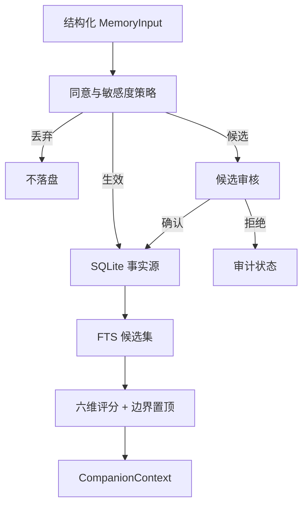
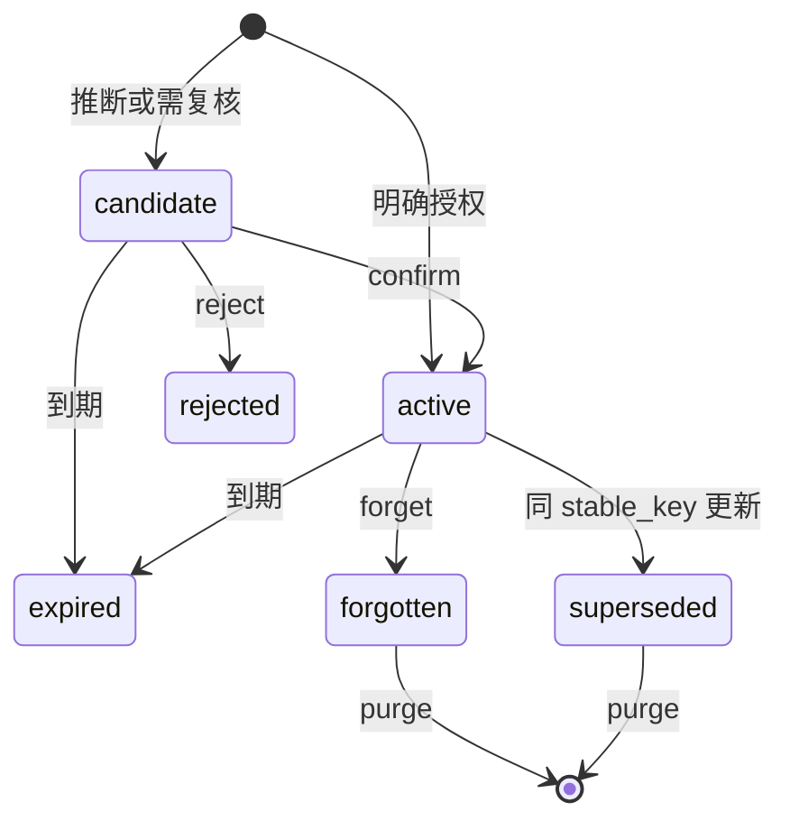

# Architecture

## 数据流

## 模块职责

| 模块 | 职责 |
|---|---|
| `schemas.py` | 领域枚举、严格输入输出模型 |
| `config.py` | TOML 合并、约束验证、配置指纹 |
| `policy.py` | 同意、敏感度、审核和保留期限决策 |
| `database.py` | SQLite schema、WAL、FTS5 和完整性检查 |
| `store.py` | 事务、证据、审计、生命周期和用户作用域 |
| `scoring.py` | 中英文 token、FTS 查询和可解释评分 |
| `service.py` | 记忆用例、边界固定召回和上下文编排 |
| `api.py` / `cli.py` | 本地 HTTP 与命令行接口 |

## 真相与生命周期

状态转换为：

`purge` 可以从任意已存在状态执行。删除后不保留正文，只保留最小审计元数据。

## 召回

1. 过期状态结算。
2. FTS 命中、全部有效边界和近期记忆组成候选池。
3. 按词面、显著性、时效、情绪、需要、意图连续性评分。
4. 边界固定在最前；普通记忆受条数和字符预算约束。
5. 输出分区上下文、评分原因、待审核数和配置指纹。

召回不会读取 `candidate`、`rejected`、`forgotten`、`expired` 或 `superseded` 记忆。
