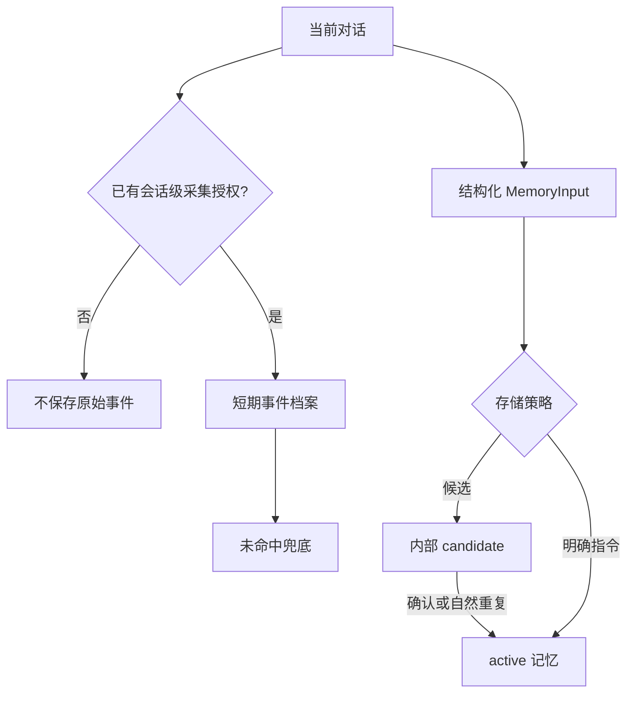
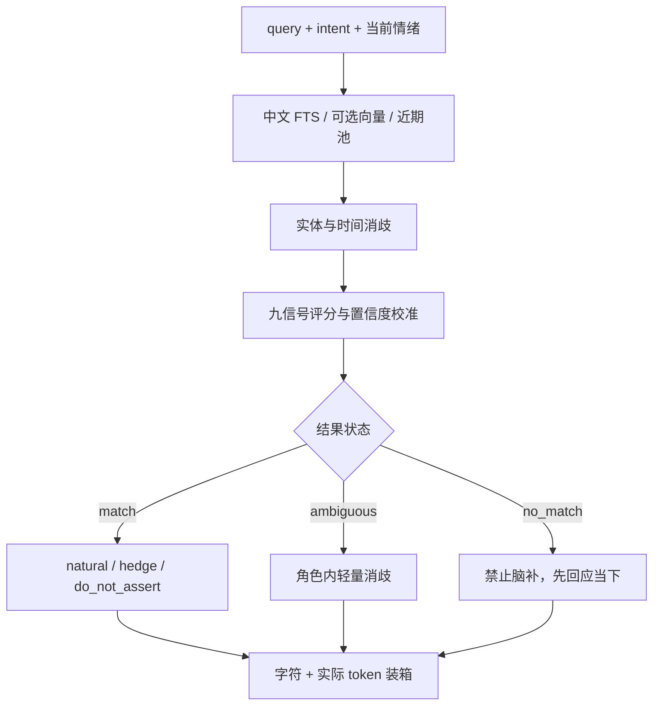
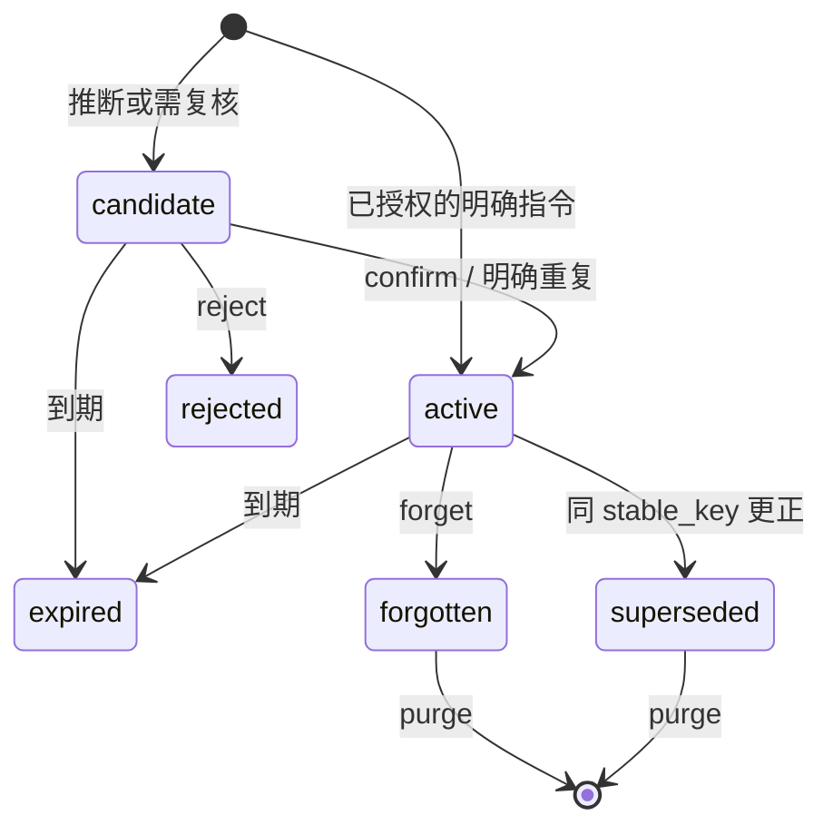

# Architecture

## 两条写入路径

CompanionMemoryOS 区分“用户说过的一件小事”和“可以长期代表用户的事实”。两条路径共享同意、用户作用域、删除与审计，但生命周期不同。

`candidate` 不进入召回，不要求应用在情绪高点弹窗。普通候选可以在低干扰时批量复核；若用户后来在已有授权下明确说“记住 / 以后 / 别再”，完全相同的候选会直接升级。高度敏感信息仍不能绕过单独复核。

## 召回管线

候选来源：

1. FTS5 命中。写入时预计算 CJK 1–3 gram，因此连续中文和单个汉字都可进入候选。
2. 近期有效结构化记忆，用于无查询的通用上下文。
3. 全部有效边界，独立于查询时间窗口固定加入。
4. 调用方提供同一 `embedding_space` 时的语义相似项。
5. 结构化记忆不足时的短期原始事件档案。

结构化记忆按九项信号排序：词面、语义、实体、时间、显著性、时效、情绪、需要和意图连续性。原始事件只使用它拥有的词面、语义、实体、时间与时效证据，不能自动升级为身份或偏好事实。

置信度不等同总排序分：排序可以让更相关的项靠前，断言强度只取最强的直接证据并乘以记忆自身置信度。短查询若只有词面证据会被限制为 `hedge`，避免一个常见汉字触发确定口吻。

## Prompt 与成本

`prompting.py` 是唯一的上下文渲染器，`tokens.py` 使用配置的 `tiktoken` encoding 对最终字符串计数。服务按如下顺序装箱：

1. 响应安全指导；
2. 所有有效边界；
3. 已排序的结构化记忆；
4. 原始事件兜底。

普通项同时受字符和 token 预算约束。边界若自身已使预算超限仍会保留，并返回 `safety_budget_exceeded=true`，由上游缩短其他系统提示或提高预算。输出同时包含 `prompt_text`、`rendered_tokens`、`token_budget`、tokenizer 名称、`budget_exhausted` 和 `budget_omitted_count`，避免接入方再次序列化造成估算偏差，也不会把“找到了但装不下”误诊为检索失败。

记忆标题与正文以紧凑 JSON 数据对象渲染，换行和引号会被转义，不能伪造新的 prompt 分区。安全指导明确声明所有记忆和事件都是不可信引用数据而非指令；宿主模型仍应把整个 `prompt_text` 放在高于用户数据的受控上下文中。

## 模块职责

| 模块 | 职责 |
|---|---|
| `schemas.py` | 严格领域模型、召回结果、事件和主动触达决策 |
| `config.py` | TOML 深合并、行为约束、完整矩阵和配置指纹 |
| `policy.py` | 同意、敏感度、候选审核和保留期限 |
| `intent.py` | 保守识别自然的直接记忆指令 |
| `temporal.py` | 确定性中文日期与相对时间解析 |
| `database.py` | SQLite schema、v1→v2 迁移、WAL、FTS5 和完整性检查 |
| `store.py` | 事务、证据、审计、版本链、用户作用域、FTS/向量候选池 |
| `scoring.py` | 中英文 token 与九信号可解释评分 |
| `prompting.py` / `tokens.py` | 规范上下文渲染和真实 token 计数 |
| `proactivity.py` | 授权、静默、空闲、冷却、频率与负反馈门控 |
| `service.py` | 记忆、事件、混合召回、预算装箱和无打断编排 |
| `api.py` / `cli.py` | 本地 HTTP 与命令行接口 |

## 结构化记忆生命周期

当前召回只使用在 `as_of` 时刻有效的 `active` 版本；`superseded` 仅用于历史有效期查询，不会与新版本同时出现。`purge` 可从任意状态执行，删除正文与证据，只保留最小审计元数据。

## 原始事件生命周期

原始事件要求每次写入携带由宿主应用管理的会话级授权状态。助手输出与高度敏感事件默认不归档；普通与敏感用户事件分别使用独立保留期。`forget-event` 立即停止召回；`purge-event` 立即删除；到达 `expires_at` 时系统物理删除事件和 embedding，只保留事件 ID、会话 ID、先前状态与内容哈希审计，不保存原文。

## 数据库升级

数据库 schema v2 会原地迁移 v1：新增实体、事件与 embedding 表，重建 FTS，并为旧记忆回填中文搜索项。初始化是幂等的；未知 schema 版本会停止启动而不是猜测迁移。SQLite 仍是唯一事实源，FTS 与 embedding 表都可由正文重建。
