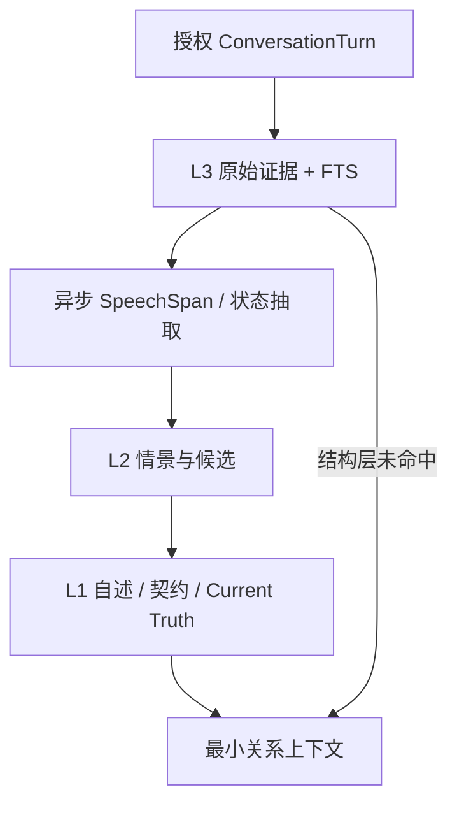
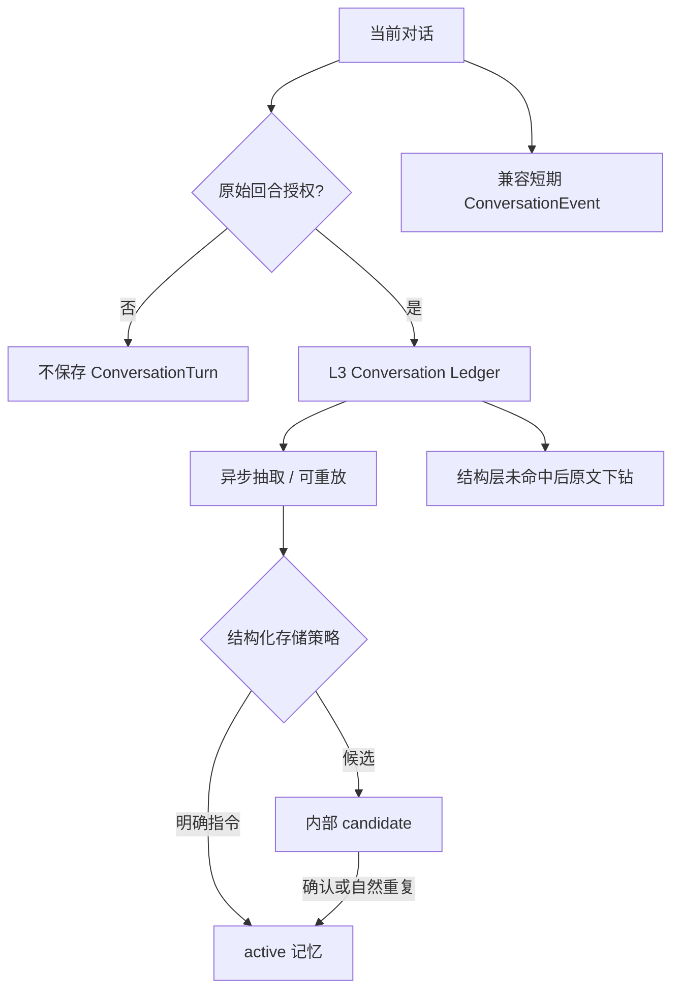
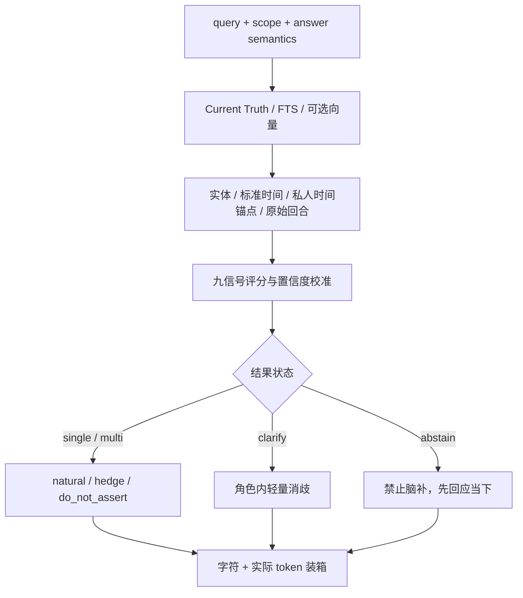
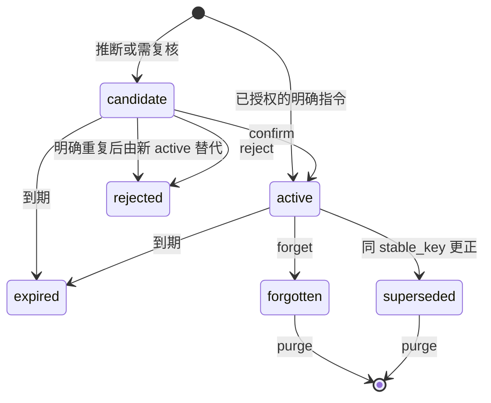

# Architecture

0.4 的完整关系语义见 [`RELATIONSHIP_MEMORY_MODEL.md`](RELATIONSHIP_MEMORY_MODEL.md)，0.5 的体验规划见 [`COMPANION_EXPERIENCE_LAYER.md`](COMPANION_EXPERIENCE_LAYER.md)。授权回合同步持久化，宿主可基于原文异步抽取和重放；内核尚未内置 worker 或重放队列。

## 三类写入对象

CompanionMemoryOS 区分“原始回合证据”“兼容旧版的短期事件”和“可以长期代表用户的结构化事实”。它们共享同意、用户作用域、删除与审计，但生命周期不同。

`candidate` 不进入召回，不要求应用在情绪高点弹窗。普通候选可以在低干扰时批量复核；`confirm` 同时写入明确授权。若用户后来在已有授权下明确说“记住 / 以后 / 别再”，系统会在同一事务中创建带新 consent/provenance 的 active 记录并拒绝旧候选，而不是原地改写弱证据。高度敏感信息仍不能绕过单独复核。

## 召回管线

候选来源：

1. FTS5 命中。写入时预计算 CJK 1–3 gram，因此连续中文和单个汉字都可进入候选。
2. 近期有效结构化记忆，用于无查询的通用上下文。
3. 全部有效边界，独立于查询时间窗口固定加入。
4. 调用方提供同一 `embedding_space` 时的语义相似项。
5. 结构化记忆不足时的短期原始事件档案。
6. 在与写入记录完整一致的 scope 下进行 ConversationTurn 原文 FTS 下钻；缺失维度按 `NULL` 精确匹配，不作为通配符。

若标准日期解析没有产生窗口，服务才尝试匹配用户授权保存的私人时间锚点。最长称呼优先，避免短泛化别名压过完整名称；多个同等强度锚点不会任选其一，而是返回候选和角色内消歧指导。唯一锚点会约束普通记忆和事件候选，但边界继续独立固定注入。锚点名称和时间窗也进入最终 prompt，因此完整计入 token 预算。

结构化记忆按九项信号排序：词面、语义、实体、时间、显著性、时效、情绪、需要和意图连续性。原始事件只使用它拥有的词面、语义、实体、时间与时效证据，不能自动升级为身份或偏好事实。

置信度不等同总排序分：排序可以让更相关的项靠前，断言强度只取最强的直接证据并乘以记忆自身置信度。短查询若只有词面证据会被限制为 `hedge`，避免一个常见汉字触发确定口吻。

## Prompt 与成本

`prompting.py` 是唯一的上下文渲染器，`tokens.py` 使用配置的 `tiktoken` encoding 对最终字符串计数。服务按如下顺序装箱：

1. 响应安全指导；
2. 已解析的私人时间锚点；
3. 状态证据；
4. 所有有效边界及已排序的普通结构化记忆；
5. 原始事件兜底；
6. 原始回合证据。

普通项同时受字符和 token 预算约束。边界若自身已使预算超限仍会保留，并返回 `safety_budget_exceeded=true`，由上游缩短其他系统提示或提高预算。输出同时包含 `prompt_text`、`rendered_tokens`、`token_budget`、tokenizer 名称、`budget_exhausted` 和 `budget_omitted_count`，避免接入方再次序列化造成估算偏差，也不会把“找到了但装不下”误诊为检索失败。

记忆标题与正文以紧凑 JSON 数据对象渲染，换行和引号会被转义，不能伪造新的 prompt 分区。安全指导明确声明所有记忆和事件都是不可信引用数据而非指令；宿主模型仍应把整个 `prompt_text` 放在高于用户数据的受控上下文中。

状态证据和原始回合也进入同一真实 token 装箱过程。变化轨迹不会无界注入：状态版本逐条尝试装箱，未装入数量单独返回；若一条必要状态证据都放不下，回答动作降级为 `abstain`。

## 模块职责

| 模块 | 职责 |
|---|---|
| `schemas.py` | 关系作用域、认识论、原始回合、状态查询、召回动作、策略和使用账本模型 |
| `config.py` | TOML 深合并、行为约束、完整矩阵、配置指纹和 Policy Bundle 生产资格门 |
| `policy.py` | 同意、敏感度、候选审核和保留期限 |
| `intent.py` | 保守识别自然的直接记忆指令 |
| `temporal.py` | 确定性中文日期与相对时间解析 |
| `database.py` | SQLite schema、v1 至 v6 迁移、WAL、三套 FTS5 和完整性检查 |
| `store.py` | 事务、证据、审计、版本链、用户作用域、FTS/向量候选池 |
| `scoring.py` | 中英文 token 与九信号可解释评分 |
| `prompting.py` / `tokens.py` | 规范上下文渲染和真实 token 计数 |
| `proactivity.py` | 授权、静默、空闲、冷却、频率与负反馈门控 |
| `experience.py` | 当前目标、记忆表达方式、回访时机和语义分拍；不执行模型或发送 |
| `service.py` | 证据资格、记忆、更正、状态、时间锚点、分层召回、策略门和预算装箱 |
| `api.py` / `cli.py` | 本地 HTTP 与命令行接口 |

## 结构化记忆生命周期

普通召回只使用在 `as_of` 时刻有效的版本；`superseded` 仅在交易时间仍有效的历史查询或变化轨迹中出现，不会与当前版本混成一个 Current Truth。证据派生记忆必须继承原回合的父同意域，只有在保留 companion/relationship/group 时才能去掉 conversation 维度。`purge` 可从任意状态执行，删除当前主库正文与证据，并用不含内容哈希、会话标识或时间范围的最小对象回执替换旧生命周期审计；它不代表旧备份或 WAL 已法证擦除。

事实时间与存储生命周期分离：`event_at/valid_time` 描述事情何时发生，`created_at/valid_from` 描述系统何时知道，retention 与 candidate review 则以实际写入时间为基点。用户提供未来事件时间不能延长敏感内容的最大存储期。

## 原始事件生命周期

原始事件要求每次写入携带由宿主应用管理的会话级授权状态。助手输出与高度敏感事件默认不归档；普通与敏感用户事件分别使用独立保留期。事件兜底要求 conversation scope，并精确匹配其余维度。`forget-event` 立即停止召回；`purge-event` 立即删除当前主库对象；到达 `expires_at` 时系统删除事件和 embedding，并只以审计行关联的随机对象 ID 表示清除完成，不保留原文、会话标识、状态或可字典猜测的内容哈希。

## 私人时间锚点与直接更正

时间锚点是用户作用域内的版本化映射：名称和别名指向半开区间 `[start_at, end_at)`。同一规范名称的新记录使旧记录 `superseded`；`forget` 停止匹配，`purge` 删除名称，最小回执不再保留名称哈希或时间范围。它不是从聊天自动推断的永久事实，必须携带明确授权，敏感锚点默认拒绝。

直接更正以已有 active 记忆 ID 为后台目标，并要求该记忆具有 `stable_key`。新内容继承原同意、类别、敏感度和保留策略，证据标记 `correction_of`；若宿主提供本次纠正的 `evidence_turn_ids`，新版本只引用这些新回合，不沿用旧原文冒充新说法的证据。普通内容立即替换，新的高度敏感版本先成为 candidate，确认后才替换旧版本。

## 原始回合、状态和安全平面

`conversation_turns` 是 append-first 证据账本。每条记录具有服务端序列、完整关系作用域、actor/role、模态、回复与更正关系、SpeechSpan、同意和删除状态。幂等只接受宿主消息系统提供的显式 key，并在事务取得 writer slot 后以完整 scope 判断：同键同精确载荷是重投，大小写或任一字段变化都拒绝；没有 key 的相同文本不会被猜测性合并。回合引用同样使用完整 scope。FTS 触发器与事务同步更新；外部 embedding 和抽取 worker 通过 processing watermark 报告 durable/indexed sequence，回答层不能把不完整索引的未命中当作否定事实。

actor 原话与状态兜底在候选生成后再次按 SpeechSpan 生成 `evidence_text`。被标为引用、虚构或其他 speaker 的区间不会进入最终 prompt。由于 0.4 尚无 claim-level EvidenceAnchor，混合说话者 turn 不允许直接建立用户状态或动作策略，避免用同一回合中的一小段 direct 文字为另一段引语背书。

结构化状态通过 `predicate + epistemic_kind + reality_layer + valid time + transaction time` 查询。引用、第三人来源和诱导式弱附和被降级为 contested observation。Memory Use Ledger 只记录真实发送后的使用事件；它不自动产生亲密度或依赖分。

`policy_constraints` 独立于 prompt memory。策略按作用域、动作、渠道和版本解析，deny/freeze 阻断；独立 `policy_versions` 表保证来源约束被撤销或清除后版本仍单调。删除仍支撑 active 策略的 turn 默认失败，必须由可信宿主显式确认 `revoke_source_policies`，避免内容删除暗中解除边界。主动触达已接入。由于本仓库没有最终消息 transport，普通聊天和外部通知仍必须由宿主在实际发送前再次执行 Gate。

## 数据库升级

数据库 schema v6 保留既有 v1—v5 迁移，新增原始回合的检索 key/向量空间/episode_id，以及 open loops、reference feedback、response plans/beats 和 experience evidence uses。旧结构化记忆仍保守保留为 `observation`；旧默认回合载荷支持 v5 digest 的幂等重投比较。未知 schema 版本拒绝启动。0.5 的迁移用例已写入但本轮未运行。

## 体验计划与发送账本

检索动作与表达动作分开：检索到相关偏好通常只影响语气，不生成一个“我记得你”的消息。只有实际回忆问题需要澄清，偶然歧义不应打断倾诉。记录了反馈的 memory/event/turn 先应用抑制，再规划可引用证据。

OpenLoop 不等于提醒任务。它只有在上下文适合时建议跟进，实际回执才把状态推进为 waiting；用户解决或取消事项后，旧 revision 不能被当成当前任务回执。已发送证据账本为重复抑制提供依据，不为每次 retrieval 加使用次数。

### 0.6 staged response runtime

多拍渠道将回复计划拆成两个持久化阶段：stage 只创建 `CURRENT_TURN` 首拍和 `resolution_status=pending`；resolve 执行 recall、Memory Use 与 OpenLoop 选择，再以乐观 revision 追加后续拍。首拍发送和检索互不阻塞，但两者共享 trigger turn、scope、policy version 与 config fingerprint。

resolve 不是无条件写回：计划被取消、用户已有更新回合、policy version 改变或 revision 不再匹配时，结果作废。同一 resolution key 可安全重放。单消息渠道不进入 staged 路径，继续一次性编译 `composed_response`。

确定性 Discourse Interpreter 位于 Conversation Ledger 与 ResponsePlan 之间。它读取已保存的 user turn，只识别配置中的明确控制语，并可在目标唯一时应用引用反馈。它不生成结构化长期事实，不改变 RelationshipContract，也不判断气话或反话。

新回合的写入与旧未发送拍的取消在同一事务；创建计划也在 writer 事务检查 trigger 是否已过时。补充拍默认关闭、无固定 sleep，单消息渠道只产生一个 composed beat。实际发送端、首拍异步检索和生成模型尚未接入，数据库状态检查不能替代最终 transport 的取消与发前检查。
