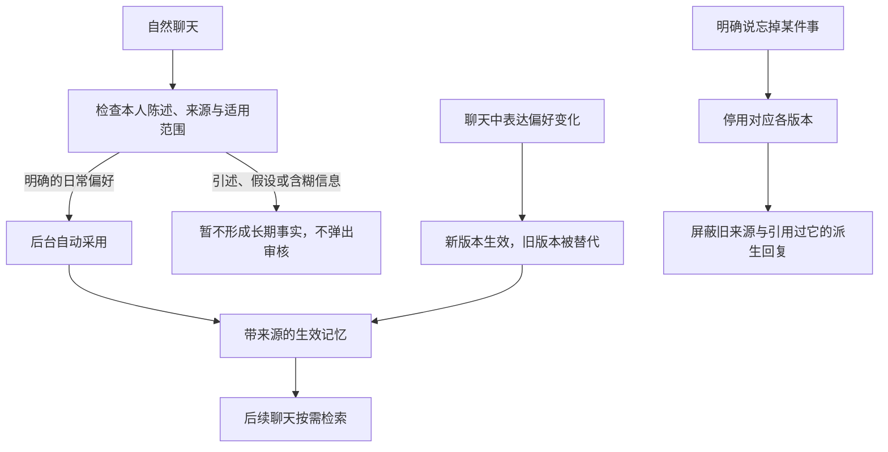

# 自动记忆：实现与能力验收

日期：2026-09-23。运行模式为离线演示；可选提取接口只使用本地 HTTP 替身，未调用真实 DeepSeek。

最终全量结果：**641 passed，1 skipped，191.97 秒**。新增自动记忆专项用例 **36 项**。
Ruff、97 个源文件的 Mypy、修改的前端脚本语法检查均通过。唯一跳过项为真实
DeepSeek 调用测试；已有依赖产生两条弃用提示，无失败。

命令：`RUN_DEEPSEEK_LIVE=0 python -m pytest --tb=short --junitxml=.agent-data/automatic-memory-results.xml`。
Windows PowerShell 使用 `$env:RUN_DEEPSEEK_LIVE='0'` 设置环境变量。
完整日志：`.agent-data/automatic-memory-tests.log`。

## 当前流程

普通偏好无需点击确认。手札只展示已生效的记忆，允许用户主动更正和遗忘。原有
`confirm_preferences_automatically` 设置兼容读取后移除，默认进入自动整理流程。
可选模型提取仍通过原有校验；只有高置信度、与本人原文直接匹配的普通偏好自动采用，
模型猜测不会因为取消确认界面就变成事实。

## 测试场景

| 能力 | 真实执行的代表场景 | 验证内容 |
| --- | --- | --- |
| 自动记忆 | “我喜欢咖啡”“我爱喝拿铁”“回复短一点” | 直接生效、保留原消息证据，回复无确认引导 |
| 不误记 | 引述、假设、疑问、过去偏好、敏感信息 | 不形成生效记忆，不要求用户审核 |
| 多条信息 | “我喜欢咖啡，我不喜欢香菜。回复短一点。先听我讲” | 四条信息独立保存 |
| 自然更正 | “我喜欢喝咖啡”→“不对，我现在不喜欢咖啡了” | 同主题版本替换，跨会话回忆新版 |
| 持久记忆 | 记住咖啡→重建服务→新会话询问 | 不需要再次提供或确认偏好 |
| 自然遗忘 | “忘掉咖啡的喜好”“把关于咖啡的记忆忘掉” | 各版本停用；无匹配时不谎报成功 |
| 历史引用隔离 | 第一会话记住→第二会话复述→遗忘→再询问 | 旧原文及助手的派生引用不进入模型上下文 |
| 失败与重投 | 回复失败后重试；遗忘后重投旧请求 | 不重复学习、不复活已遗忘记忆；新陈述可重新学习 |
| 模型提议约束 | 本地替身返回高置信度原文／低置信度／虚构内容／他人信息 | 原文充分的偏好自动生效，其余不进入用户审核队列 |
| 网页体验 | 聊天→手札→口头更正→新会话回忆→口头遗忘→再次询问 | 无逐条记忆确认；控制台无错误或警告 |

测试在独立临时数据库与 `.agent-data/automatic-memory-ui` 中执行，没有将上述测试
偏好写入正常应用的数据目录。用例见 `tests/test_automatic_memory.py`，并更新此前
功能测试对自动生效的预期。

## 测试发现并修复

1. 否定偏好的长句已保存，却因本地词语匹配弱而在新会话中漏召回。增加常用问句与
   口语词的归一，保留否定内容；向量空间升级，旧缓存不会混用。
2. 遗忘原始来源后，另一会话里曾复述该记忆的助手消息仍可被独立召回。根据持久化
   回复计划找到引用者，并沿上下文依赖屏蔽派生回复，补充了真实复述场景的回归用例。

## 能力边界

- 当前离线提取仍为有限句式规则。“最近苦味让我很舒服”等隐含喜好暂不能理解；
  测试证明的是不编造该偏好，不能据此宣称具备通用语义理解或情感理解。
- “忘掉这件事”只在紧接着的本人陈述能对应记忆时处理；指代无明确目标时保持原状，
  不显示确认选项，也不谎称已经遗忘。
- 遗忘为逻辑停用和上下文屏蔽，原始聊天正文仍保留。一条原始消息含多个事实时，
  为避免带回被遗忘的部分，会保守屏蔽整条原文和受其影响的回复。
- 浏览器离线演示与接口测试不证明真实 DeepSeek 的表达质量、复杂语义理解、真实
  微信可用性或安卓设备操控质量。
