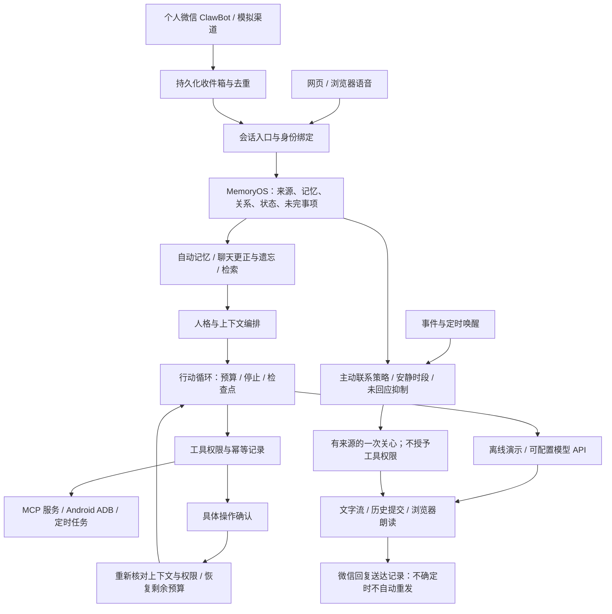

# 心隅：功能闭环与离线验收

实现日期：2026-09-23。延续 `COMPANION_MARKET_ANALYSIS.md` 的四轮建议；本轮不连接真实 DeepSeek。

## 运行

执行 `./start-romance.ps1`，打开 `http://127.0.0.1:8765`。在陪伴设置中选择“离线演示”，允许本地保存与所选模式处理消息。API Key 可以留空。

离线模式是确定性的流程演示，不是本地大模型：可整理限定句式的喜好与沟通反馈、调用提醒工具、运行完整权限循环。它不会调用聊天 API、模型提取器或 Embedding API。MCP、手机和微信是独立能力，仅在用户启用并授权时调用，离线对话模式不代表这些外部工具也被模拟。

## 架构

## 可操作的验收流程

1. 说“我喜欢咖啡”，偏好自动生效，不需要用户选择是否记住。新会话可回忆；说“我现在不喜欢咖啡了”会替换旧版本，说“忘掉咖啡的喜好”会停用各版本并阻止旧来源进入后续回复。手札只展示已生效的记忆，可主动更正或遗忘。
2. 说“以后少说教，先听我讲”，记录明确的相处反馈。它影响后续上下文，不根据单次情绪杜撰人格变化。
3. 说“我明天下午有面试，有点紧张”。手札出现待跟进事件；用户选择何时之后可以关心，并在设置开启主动联系。含糊的“下午”不会被猜成具体时刻。
4. 说“面试取消了，先别问我”，取消该事件；“别主动联系我”关闭主动联系。用户未回应上一条主动消息时，其他到期事件也保持安静。
5. 说“5 分钟后提醒我喝水”，真实写入本地任务。定时器在服务保持运行时触发；无需真实模型。MCP 默认逐次确认，批准后继续原任务；较新的用户消息会阻止旧任务自动继续。
6. 能力与定时 → 消息渠道 → 本地模拟消息，绑定当前会话并开启。输入消息后，它和网页聊天共享历史、关系、记忆。相同送达 ID 只处理一次。
7. API 模式的文字流通过真实 HTTP SSE 协议接入，用本地 HTTP 替身测试。流式中间文字仅显示，成功结束才写入历史；推理内容不显示或持久化。
8. 语音按钮调用浏览器的识别与朗读能力。识别文字进入同一输入框，由用户确认发送；浏览器不支持时明确提示。识别服务可能联网，默认不开启。桌面通知需点击授权，页面关闭后不保证桌面通知。

## 模型与检索

- API 模式保留已有 DeepSeek 配置；默认离线。模型提取开关接入原有 `OpenAICompatibleInterpreter`，模型提议经原有来源、主体、引用和现实层检查。高置信度（至少 0.85）、与本人原文直接匹配的普通偏好自动采用；其余留在内部候选区，不出现在用户审核队列中。置信度本身不能证明事实，原文与来源检查不可省略。
- 本地检索是 256 维词语特征哈希，附少量中文同义归一，配合原有全文检索。**不能当成真实语义向量模型**。
- 独立 Embedding API 支持 `/embeddings`，地址、模型、凭证环境变量分别配置，不复用 DeepSeek Key。索引和查询使用同一空间；服务不可用时回退全文检索。离线模式不会调用该接口。
- 日常明确偏好默认自动学习，原有逐条确认开关已迁移移除。离线仅识别有限句式；引述、假设、敏感内容和隐含偏好不自动采用，也不追问是否保存。长期质量、隐含情绪与角色自然程度仍需真实模型和人工评估。
- 遗忘为逻辑停用，不物理删除聊天正文。来源限制同步作用于历史上下文及其派生回复；一条原始消息同时包含多个事实时，原始消息整体不再注入，以避免遗漏被遗忘的部分。重新明确陈述可建立有新来源的新记忆，重投旧请求不会复活记忆。

## 微信与手机

个人微信文本适配参考 [AstrBot 固定版本的 Weixin OC 协议](https://github.com/AstrBotDevs/AstrBot/blob/95e98b8aed75d56713666eff39e31bafffd95426/astrbot/core/platform/sources/weixin_oc/weixin_oc_adapter.py)。提供登录入口、登录状态检查、后台收取与本人消息回复。此实现只处理文本；不处理图片、文件或语音，不读取通讯录，不向任意联系人发消息。

微信默认关闭。登录产生的 Token 只放运行内存，重启需重新登录，或由 `COMPANION_WEIXIN_TOKEN` 提供。收件箱、消息游标和送达状态保存到本地 SQLite；凭证不出现在前端、聊天、导出或错误内容中。发送中崩溃/超时的结果标为“不确定”，不自动重发。微信主动推送未开启，主动关心在应用内送达。

Android ADB 继续使用已有 MCP：指定 USB 设备、应用包名和联系人范围，写操作绑定观测状态。确认过期、界面变化和不确定执行不会被静默跳过。真实手机和真实微信需要后续实机验证，本轮只用替身测试。

## 持久化与限制

- 检查点保存来源 turn ID、操作 ID、预算和状态，不保存推理或完整模型提示。审批后重新生成上下文，并从执行记录继续。
- 拒绝、来源删除、更新的用户指示、权限变化、时间/工具/Token 上限都会停止或阻止恢复。已成功的外部动作不会因回复失败再次执行。
- 主动关心使用原有策略：至少空闲 4 小时、冷却 12 小时、每日最多 2 次，以及用户配置的安静时段。不会在未明确选定跟进时间时猜测何时联系。
- 后台任务依赖本地进程和电脑运行。网页可以关闭；未安装 Windows 服务或系统级唤醒机制。
- 功能测试可以证明协议、状态和边界，不能证明情感陪伴质量或真实设备可用性。

验证结果见 `ROMANCE_VALIDATION.md` 最新章节。
